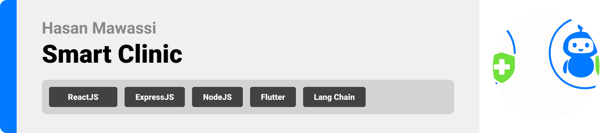
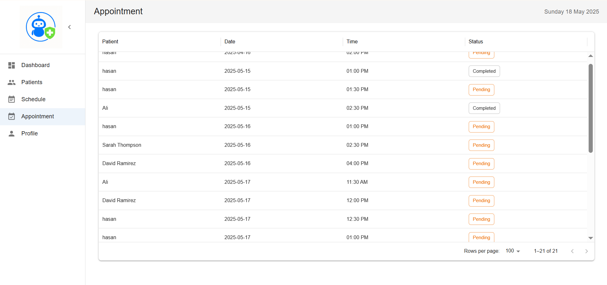

  

<!-- project overview -->

> **Welcome to the future of healthcare access where patients speak, and AI listens.**
> Imagine booking a doctor’s appointment just by speaking whether in Arabic or English. No waiting lines, no confusing forms. Just you and a chatbot that listens, understands, and books instantly.
>
> **But that’s just half the story.
> On the doctor’s side?**
> A smart web dashboard that turns raw patient data into actionable insights.
> Each patient comes with an AI-generated health snapshot summarizing key medical history and highlighting what matters most for better, faster decision-making.

  

<!-- System Design -->

### Data Model & Relationships

- Smart Clinic Database.
  
    

<!-- Project Highlights -->

### Project Features

- **Smart AI, Smarter Decisions:** Elevate clinical care with AI-powered insights from symptom analysis to instant, structured patient reports. It’s like giving doctors a second brain that never sleeps, helping them move faster with more confidence.
- **Talk or Text. Book in Seconds:** Say goodbye to call queues and forms. Patients can book appointments just by texting or texting in English or Arabic making healthcare more accessible, and freeing up valuable time for medical staff.
- **Interactive Doctor Dashboard:** From appointment tracking to real-time patient analytics by age, gender, and history the doctor’s dashboard turns complex data into actionable insights at a glance.
    

| Project Features                         
| ----------------------------------------- |
|  

 |
  
<!-- Demo -->

### Patient Screens (Mobile)

| Home screen                                                       | Chatbot screen                                                        | Appointment screen                                                   |
| ----------------------------------------------------------------- | --------------------------------------------------------------------- | -------------------------------------------------------------------- |
|  |  |  |

### Doctor Screens (Web)

| Dashboard screen                                                       | Patient screen                                                       |
| ---------------------------------------------------------------------- | -------------------------------------------------------------------- |
|  |  |

| Appointment screen                                                       | Patient screen GIF                                                     |
| ------------------------------------------------------------------------ | ---------------------------------------------------------------------- |
|  |  |

  

<!-- Development & Testing -->

### Add Title Here

| Services                                  | Validation                             |
| ----------------------------------------- | -------------------------------------- |
|  |  |

| Testing                                                            |
| ------------------------------------------------------------------ |
|  |

  

<!-- Deployment -->

### CI/CD Magic: Deploying Smarter, Not Harder

- The project is containerized using **Docker** and managed through **Docker Compose** for consistent multi-service environments across development, staging, and production.

CI/CD is handled via **GitHub Actions**, with custom workflows set up to automatically build, test, and deploy the application to two separate **AWS EC2 instances**:

- **Staging Server**: For testing new features before production release.
- **Production Server**: For live deployment, ensuring high availability and performance.

Each push to the corresponding branch triggers the appropriate workflow, enabling **seamless and automated deployment** with minimal manual intervention.

| Postman API 1                           | Postman API 2                         | Postman API 3                         |
| --------------------------------------- | ------------------------------------- | ------------------------------------- |
|  |  |  |

  
